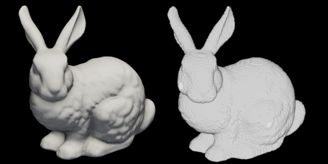
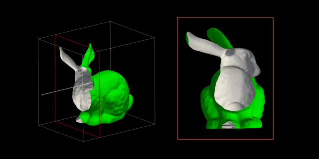

# stl2bmp

* stl2bmp voxelizes (descritizes) STL files as stacked 1bit bitmap images. 
* The user can control pixel resolution by DPI.
* it computes reasonably fast by using OpenGL Z-buffer.
# Build
## Dependencies 
* C++17 or C++14 + Boost(filesystem)
* OpenGL 
* GLFW (3.0 or later)
* Eigen (3.0 or later)
## Build with cmake
```shell
% mkdir build    
% cd build 
% cmake ..
% make 
% 
```
## Usage 
```shell
% stl2bmp input.stl {dpi}
```
* input.stl: Input STL file (binary). The mesh must be closed and clean. 
* {dpi}: DPI value. Default value is 360 [dpi].

Voxelized images are saved as 1bit Bitmap images in input/ (stem of the input file). 

### Example
``` shell
% ./stl2bmp torus.stl
stl2bmp v.1.0.0
dpi:360
   29/29
Images saved to "/hogehoge/torus".
%
```
## Brief introduction to the algorithm
The program just renders the input mesh from the specific viewpoint by parallel projection.
It carefully sets a clipping plane so that the near plane corresponds to the sampling plane.
When the background colors, front face color and back face color are assigned to black, black and white respectively, the rendered images will be voxelized image of the sampling plane. 
By changing the distance of near clipping plane, we can obtain voxelized images of the mesh. 
We suppose that the input mesh is closed and clean ( no skiny triangles). You may need repair meshes created by some softwares (e.g. Polymender, Meshlab).

# License
* MIT License (See LICENSE.txt)
# Author
* Takashi Michikawa <peppery-eternal.0b@icloud.com> : Image Processing Tream, RIKEN Center for Advanced Photonics.

